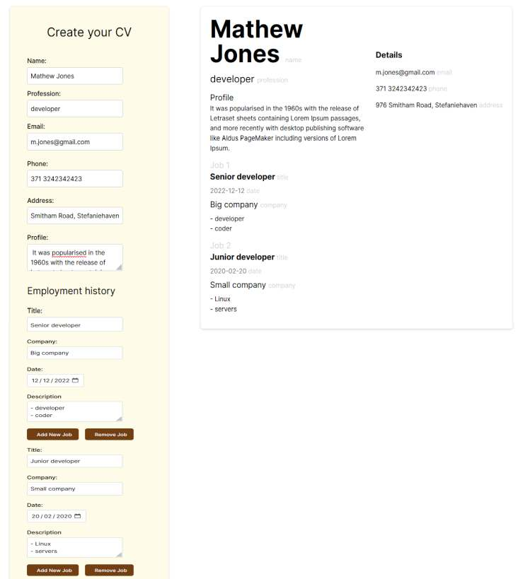

# CV Creator App

A simple React web application to create your CV with multiple job experiences.

## Features

- Create and customize your CV with ease.
- Add and remove multiple job experiences.
- View and edit the main CV information.

## Technologies Used

- React
- TypeScript
- Tailwind CSS

## How to Use

1. Clone the repository to your local machine.
2. Install dependencies using `npm install`.
3. Start the development server using `npm start`.
4. Access the application in your web browser at `http://localhost:3000`.